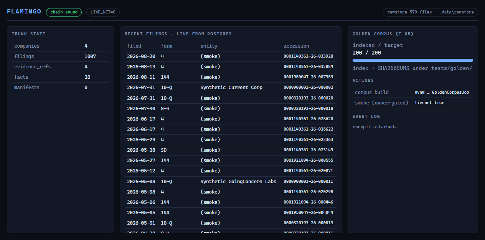

# FLAMINGO

Compliance and financing tooling for U.S. small-cap capital markets — the data
spine that ingests SEC reality, evaluates it against Rule 15c2-11 obligations,
and renders audit-grade diligence artifacts.

> MODEL: z-ai/glm-5.3-flash@openrouter | UTC: 2026-08-27 | SESSION: flamingo-parallel-wave
> (Provenance Law header per STACK RULING — every PR body and ledger report repeats it.)

## The portfolio — all nine products, one trunk

| # | Product | Customer / fee | Status | Where it lives |
|---|---|---|---|---|
| 1 | **TRUNK** — ingest→facts→gap-rules→evidence chain | internal | **BUILD-NOW · LIVE** | `flamingo-edgar`, `flamingo-trunk` |
| 2 | **P1** Dealer Diligence Packets (Rule 15c2-11 review packets + draft memos + WORM archive) | broker-dealers, $1.5K/mo | BUILD-NOW · in build | trunk + `packets/` (T-15..T-20) |
| 3 | **P2** Restoration Workspace (delinquency-cure case management) | trapped issuers, $15–40K | BUILD-NOW · in build | `trunk/restoration/` (T-14) |
| 4 | **P3** Offering Drafter (cited Dilution/Cap/UoP sections) | issuers, $15K/yr | GATE 1-LOCKED | reserved T-26..T-33 |
| 5 | **P4** Buyer-List Builder (presence-based institutional targeting) | IR heads, $5K/yr attach | GATE 1-LOCKED | reserved T-34..T-37 |
| 6 | **P5** Rights-Offering Rail | issuers, per-deal+SaaS | GATE 2 + counsel-locked | reserved T-41.. |
| 7 | **P6a** Blue-Sky Automation | issuers, subscription | GATE 2-LOCKED | reserved T-38.. |
| 8 | **P6b** PIPE Kit (clause library for counsel seats) | law firms | GATE 2-LOCKED | reserved T-39.. |
| 9 | **P7** Evidence Engine (outcome-pattern detection) | analytical buyers | label-harvest NOW · modeling GATE 2 | ADR-0007 vocabulary live |

**Gate discipline (R9):** gated products contain ZERO code, configs, or dirs until
the owner types `GATE 1 PASSED` / `GATE 2 PASSED`. The CI structural allowlist
(`scripts/dir_allowlist_check.sh`) fails any build where a locked product's
directory exists. This is a legal-perimeter feature, not an omission.

**R7 sealed scope (absolute):** nothing involving trading venues/ATS
infrastructure, aggregating investor demand, or initiating communications to
investors exists in this repository — by design, enforced culturally and
structurally. That wall is what makes broker-dealer customers able to buy
everything else.

## Live capabilities (verified end-to-end)

| Capability | Proof |
|---|---|
| SEC ingest, raw-first (R1) | 1001 real filings landed; every row sha-bound to its deriving snapshot under `.data/rawstore` (568 evidence artifacts) |
| Append-only supersession (R8) | re-runs insert 0; conflict ⇒ DO NOTHING; history closed via valid_to/superseded_by, never deleted |
| Evidence hash chain | manifests with prev→own sha256 chain; tamper test mutates one byte ⇒ chain breaks loudly incl. successors |
| Golden corpus (T-05) | 200 real 424B5 primary documents, 151 issuers, `tests/golden/{index.json,SHA256SUMS}`, resumable, index↔disk hash-verified |
| Rule engine (T-11/T-12) | pack v0 as data (`DISC-001/002`, `FIN-001/002`); deterministic double-eval (identical state_hash); reproduces fixture expected_flags exactly |
| Facts + tag dictionary (T-07/T-08) | canonical concepts via per-namespace candidate maps (dei/us-gaap/ifrs-full); config-only growth |
| Capital structure (T-09) | layered reconstruction + 0.5% DISCREPANCY guard; packet generation refuses blocked issuers |
| Instruments (T-10) | converts/warrants from exhibit prose → `needs_confirmation` human queue w/ citations |
| Restoration (T-14) | Engaged→…→Monitored state machine, Monitored→CatchUp drift-back, event-sourced |
| Concurrence (T-06/T-20) | 3 synthetic issuers incl. seeded analyst disagreement; CLI computes engine-vs-analyst concurrence % |

## Operator cockpit

```bash
cd infra && docker compose up -d        # Postgres :5434 + MinIO (WORM parity)
cd ..
mvnw.cmd -B -ntp package -DskipTests
java -jar flamingo-bootstrap/target/flamingo-bootstrap-0.1.0-SNAPSHOT.jar --server.port=8177
# → http://localhost:8177  (live counts, chain verdict, filings feed, corpus progress)
```

Tasks (owner-gated, network-touching):

```bash
# single-CIK ingest demo (≤5 requests, token-bucketed)
java -jar …jar --task=smoke --livenet=true --sec-user-agent="Flamingo Research <you@example.com>"

# golden corpus build/resume (month-window FTS → 424B5 documents, R1-stored)
java -jar …jar --task=golden --golden.target=200 --livenet=true --sec-user-agent="…"
```

## Architecture

| Module | Contents | OSS license at publication |
|---|---|---|
| `flamingo-edgar` | SEC client: mandated UA, token bucket ≤5rps/≤3conc, backoff+jitter, R1 raw-first store, FTS lanes | Apache-2.0 |
| `flamingo-trunk` | ingest · facts · tag dictionary · rule engine · capstruct · instruments · restoration · concurrence · evidence chain | AGPL-3.0 + commercial dual |
| `flamingo-bootstrap` | runnable app, cockpit, task modes | proprietary |

Stack: Java 17 · Spring Boot 3.5.4 (BOM-import multi-module) · Flyway V1–V8 ·
PostgreSQL 16 · JdbcTemplate (no ORM — R8's interval-versioned rows are temporal
constraints, not entities) · Testcontainers-isolated DB tests · records over
Lombok · MinIO (Object-Lock parity for the WORM archive).

**Invariants:** R1 raw-first · R2 provenance-complete orphans fail loudly ·
R3 no stubs in evidence/WORM/auth · R4 byte-identical replay · R5 dependency
discipline · R6 TODO-UNKNOWN never silent · R7 sealed scope · R8 supersession
never deletion · R9 gates are owner-typed only.

## See it



**[docs/PRODUCT.md](docs/PRODUCT.md)** — all nine products with screenshots, in plain language · **[docs/ROADMAP.md](docs/ROADMAP.md)** — what's next · **[docs/GALLERY.md](docs/GALLERY.md)** — evidence gallery what every
number means, the three-issuer story, the four-flag delinquency catch, the
restoration drift-back, and why the instruments queue is human-gated.

## Docs

- `docs/ROADMAP.md` — shipped / in-flight / next / locked
- `docs/adr/0001–0011` — every governing decision incl. single-runtime ruling, Arelle contingency trigger, loom lineage
- `docs/HISTORY-20260827-rewritten.md` — forensic note on the one history repair
- `tests/concurrence/README.md` — fixture format contract
- `docs/OPERATIONS.md` — day-2 ops (coming with T-13 scheduler)
