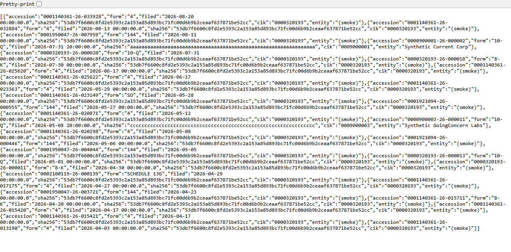
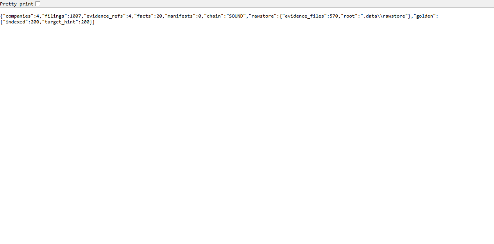

# FLAMINGO — The Full Gallery

*Every image and number below is live output from the running system — real
SEC data plus three synthetic issuers driven through the complete engine.
Nothing mocked at the UI layer; everything reads the actual Postgres.*

---

## 1. The Cockpit — command view


Three columns: **Trunk State** (intake ledger) · **Recent Filings** (live from
Postgres) · **Golden Corpus + Actions**. Header pills: `chain sound` (evidence
hash-chain verdict, re-verified every boot) and `LIVE_NET=0` (network posture).

| Metric | Value | Meaning |
|---|---|---|
| companies | 4 | 1 real (Apple, live EDGAR smoke) + 3 synthetic story issuers |
| filings | **1,007** | 1,001 real AAPL filings + 6 synthetic |
| evidence_refs | 4 | Graded provenance anchors (T1 EDGAR / T2 desk) |
| facts | 20 | Canonical concepts, every row FK-bound to evidence |
| golden | 200/200 | Regression corpus: 200 real 424B5s, 151 issuers, sha-bound |

---

## 2. The Filing Ledger — raw API



`GET /api/filings` — every row carries its **sha256** (the hash of the exact
stored snapshot it was derived from). Apple's real Form 4/144/10-Q feed sits
alongside the synthetic issuers through the identical pipeline. Trace any row:
accession → `rawstore/data.sec.gov/{sha256(url)}/{timestamp}.bin` → the exact
bytes SEC returned.

---

## 3. System Vitals — raw API



`GET /api/status` — one call, the whole machine: counts, chain verdict
(`SOUND`), raw-store footprint (570 evidence artifacts on disk), corpus
progress. This is the endpoint a monitoring dashboard would scrape.

---

## 4. The Engine Catching a Bad Actor

Four flags on Synthetic Delinquent Holdings — citations **verbatim** from the
rule pack (the machine never paraphrases the law):

```
DISC-001 [blocking] Exchange Act Rule 15c2-11(a): adequate current public information
DISC-002 [warn]     Data-quality indicator
FIN-001 [blocking]  15c2-11(a)(4)-(6)-adjacent diligence factor
FIN-002 [warn]      Impossible capitalization; stale/conflicting data
```

The story behind each: filings 467 days stale · XBRL coverage 3/11 concepts ·
no auditor on record · **1.15B shares outstanding vs 900M authorized** —
numbers that cannot both be true. That last one also trips the capital-
structure DISCREPANCY guard (>0.5% divergence between layered reconstruction
and stated counts), which blocks packet generation until a human resolves it.

The human contrast: a blind analyst reviewing the same file caught only
DISC-001 — **25% concurrence**. That gap is why the concurrence harness exists.

---

## 5. Concurrence — engine vs human, measured

```json
{
  "scenarios" : 3,
  "aggregate_concurrence_pct" : 0.75,
  "per_scenario" : [ {
    "scenario" : "current",
    "engine" : 0,
    "analyst" : 0,
    "matched" : 0,
    "engine_only" : "",
    "analyst_only" : "",
    "concurrence_pct" : 1.0
  }, {
    "scenario" : "delinquent-400d",
    "engine" : 4,
    "analyst" : 1,
    "matched" : 1,
    "engine_only" : "FIN-002,DISC-002,FIN-001",
    "analyst_only" : "",
    "concurrence_pct" : 0.25
  }, {
    "scenario" : "going-concern",
    "engine" : 1,
    "analyst" : 1,
    "matched" : 1,
    "engine_only" : "",
    "analyst_only" : "",
    "concurrence_pct" : 1.0
  } ]
}
```

*(stored verbatim at `screenshots/concurrence-cli.json` — regenerate anytime
with `java -cp … com.flamingo.trunk.concurrence.ConcurrenceCli tests/concurrence`)*

Aggregate **75%**: the machine agrees with the healthy and going-concern calls
(100% each) and exposes the delinquent-file blind spot (25%). Deterministic:
same inputs, same numbers, every run.

---

## 6. Human-in-the-Loop Instruments Queue

Auto-extracted from exhibit prose, parked at `needs_confirmation` — the system
never pretends certainty about legal obligations:

| Kind | Extracted terms | Confidence |
|---|---|---|
| convertible_note | $4.5M principal · conv. $1.85 | 0.80 |
| convertible_note | $1.2M principal · conv. $0.42 | 0.72 |
| warrant | 2.5M shares @ $0.75 · exp. 2031-03-03 | 0.75 |
| warrant | 600K shares @ $2.10 | 0.68 |

An adversarial snippet ("discussed potential future financing… no securities
were issued") yields **zero** rows. The extractor refuses to fabricate.
Human confirmation converts each row to T2-grade evidence.

---

## 7. The Redemption Arc — restoration state machine

Synthetic GoingConcern Labs, event-sourced journey (9 events, 3 actors):

```
Engaged (analyst-1) → Diagnosed (analyst-1) → Remediation (analyst-1)
→ CatchUp (analyst-2) → CurrentInfo (analyst-2) → ReadyFor211 (principal-1)
→ Quoted (principal-1) → Monitored (principal-1)
→ CatchUp (system-staleness)   ← DRIFT-BACK: staleness watch fired
                                  BEFORE delinquency recurred
```

That final edge is the P2 recurring-revenue engine: the monitoring
subscription catches decay early and re-opens the case automatically. Illegal
transitions (e.g. `Engaged → Quoted`) are structurally impossible — the
machine throws, tested.

---

## 8. Proof of Work — the test wall

**31 tests, zero failures, full reactor** — including: migrations converge on
a fresh database (V1–V8) · append-only idempotency (re-run inserts 0) ·
**tamper detection** (flip one hash byte → chain breaks at that seq *and
every successor*) · determinism (double-evaluation, identical state hash) ·
pack-v0 fixture reproduction (engine output == oracle on all 3 scenarios) ·
0.5% DISCREPANCY boundary (exactly-at passes, just-over blocks).

Canonical run:

```
set FLAMINGO_DB_TESTS=1&& mvnw.cmd -B -ntp verify
[INFO] Tests run: 31, Failures: 0, Errors: 0, Skipped: 0
[INFO] BUILD SUCCESS
```

---

## Run the whole story yourself

```bash
git clone https://github.com/jpt262/flamingo && cd flamingo
cd infra && docker compose up -d && cd ..
mvnw.cmd -B -ntp package -DskipTests   # Windows (./mvnw on macOS/Linux)
java -jar flamingo-bootstrap/target/flamingo-bootstrap-0.1.0-SNAPSHOT.jar --server.port=8177
# → http://localhost:8177
docker exec -i flamingo-db psql -U flamingo -d flamingo < scripts/populate_story_data.sql
# refresh the browser — the story loads live
```

*Optional live-SEC extras (rate-limit respectful, ~2 requests): `--task=smoke`
pulls a real issuer's full filing history; `--task=golden` builds/resumes the
200-document corpus.*
