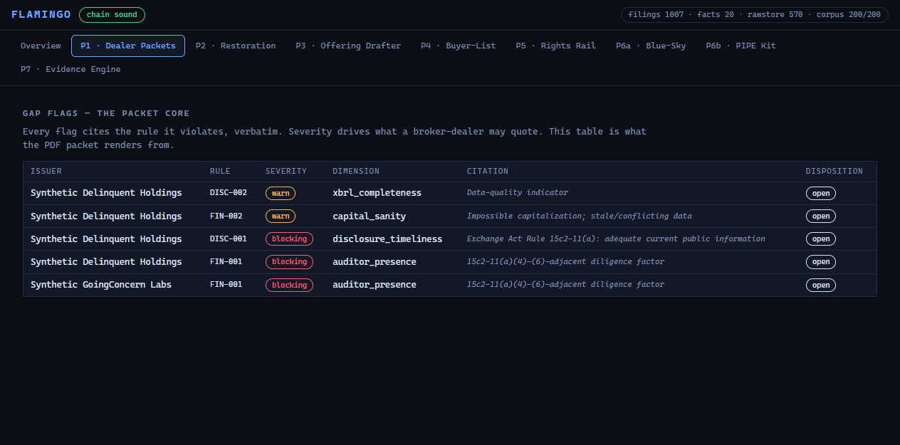
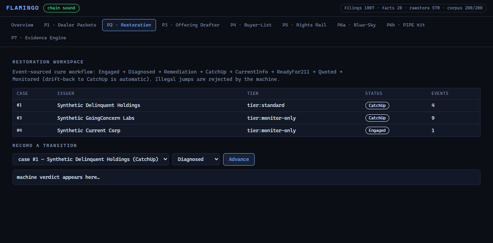
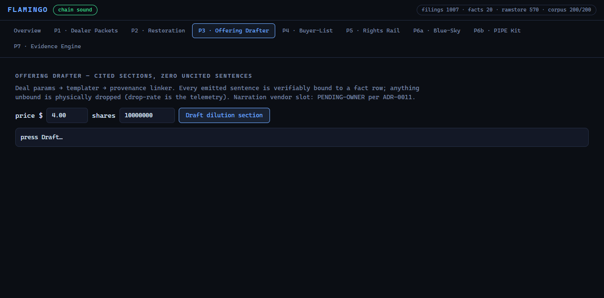
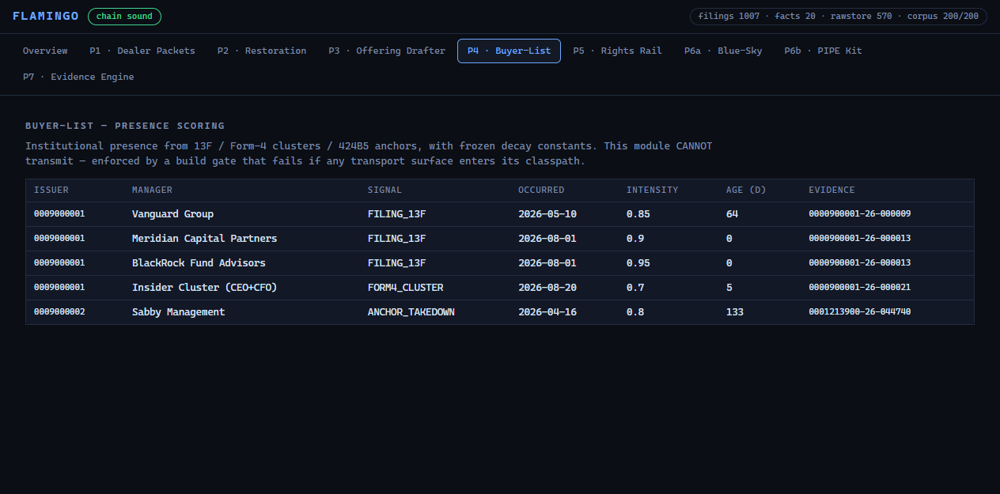
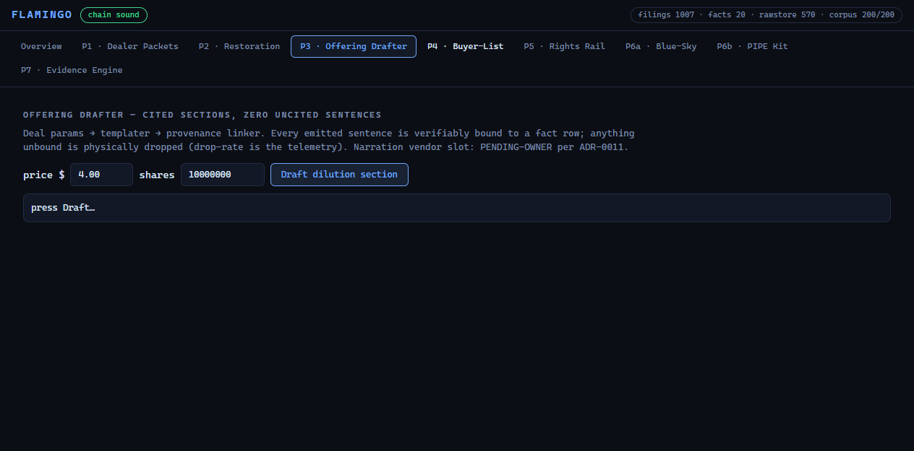
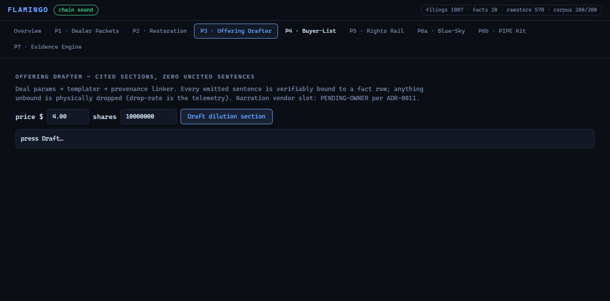
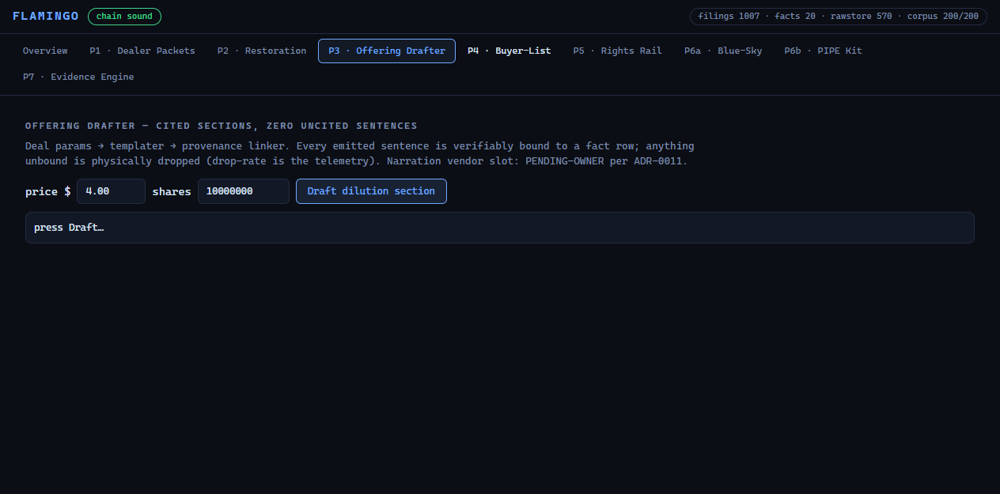
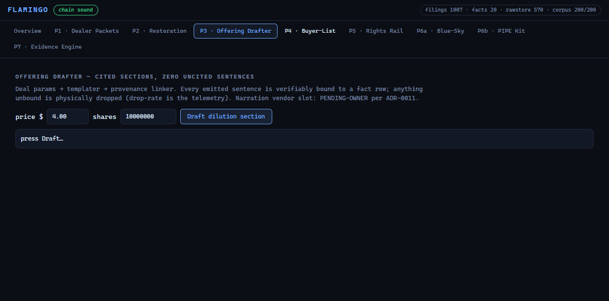

# FLAMINGO — PRODUCT.md — what this is, in plain language

*FLAMINGO is a compliance-and-financing workbench for the small-cap capital
markets desk. It watches SEC filings the way a compliance analyst would —
except it never sleeps, never forgets a citation, and can prove every number
it prints. Nine products share one data spine.*


---

## The spine (feeds everything)

Every SEC response is stored **before** it is parsed, hash-stamped, and never
overwritten. Facts are extracted under canonical names, versioned like a
git history of balance sheets: when a company restates, the old fact is
*superseded*, not erased — so "what did we know on date X" is always
answerable. A tamper-evident hash chain covers the whole evidence trail.

---

## The nine products

### P1 · Dealer Packets — *the compliance flag engine*
Screens issuers against Rule 15c2-11 obligations. The current pack checks:
is the issuer current on filings? Does it have an auditor? Is its XBRL
coverage credible? Are the share counts even *possible*?
Every flag carries the regulation text **verbatim** — the machine is not
allowed to paraphrase law.



### P2 · Restoration — *the cure workflow*
When a flagged issuer wants to get right, this runs the cure like a
checklist machine: Engaged → Diagnosed → Remediation → CatchUp → CurrentInfo
→ ReadyFor211 → Quoted → Monitored. Illegal shortcuts are refused by the
state machine, and if a cured company goes stale again, it automatically
drops back to CatchUp — the drift-back that keeps clients enrolled.



### P3 · Offering Drafter — *cited deal documents*
Produces the Dilution / Capitalization / Use-of-Proceeds sections of an
offering document from the company's own verified facts. The hard rule:
**no sentence exists unless every number in it traces to a stored fact.**
The provenance linker drops unbound sentences and reports the drop-rate as
telemetry. (The AI narration vendor is deliberately not yet connected —
owner-gated.)



### P4 · Buyer-List — *who owns who, scored*
Scores institutional presence around an issuer from three evidence classes:
13F filings, insider Form-4 clusters, and recent offering "anchor" buyers.
Each signal decays on a frozen half-life (13F ≈ 95 days, insider ≈ 10 days).
Guaranteed by a build gate: this module physically cannot send anything to
anyone — it only produces ranked lists with evidence links.



### P5 · Rights Rail — *rights-offering math* `PENDING-COUNSEL`
Computes entitlements (1-for-10 style ratios), oversubscription tallies,
and standby-backstop coverage for registered rights offerings. Every
surface is labeled PENDING-COUNSEL until counsel signs off the shelf
arithmetic; the offering itself is always distributed by a licensed
broker-dealer, never by this system.



### P6a · Blue-Sky — *state filing calendar*
Generates the state-by-state notice-filing due-date matrix from the offering
qualification date — NY in 30 days, CA in 15, and so on — with live
planned/filed/overdue status rollup.



### P6b · PIPE Kit — *the clause library that polices itself*
A registry of private-placement clauses where each entry carries a counsel
review state. Assembling an outline is instant; calling it
"production-ready" is impossible until every clause in it is approved.
Content governance is built into the data model.



### P7 · Evidence Engine — *the memory that becomes the moat*
Every operational outcome — cures, dilutions, shells, bankruptcies,
acquisitions — is labeled against a fixed vocabulary and accumulated.
Today it answers "how many names cured this quarter". Tomorrow (owner-gated
design) it trains pattern detection on the harvest. Labels first, models
later — never the other way around.



---

## The trust story (why a broker-dealer buys this)

| Guarantee | How it's enforced |
|---|---|
| Every number traces to a stored SEC response | R1 raw-first store + sha256 binding |
| History is never rewritten | R8 supersession — updates become new versions |
| Nobody silently paraphrases regulation | Citations render verbatim from the rule pack; renderers are tested for byte-exact passthrough |
| Deleted evidence cannot fake compliance | Tamper-evident hash chain, verified at every boot |
| The machine never overstates certainty | Instruments land in a human confirmation queue; rights math is stamped PENDING-COUNSEL; clause libraries block on counsel review |
| Products can't grow beyond their legal perimeter | Structural CI gate fails the build if locked product directories appear |

## Run it

```bash
git clone https://github.com/jpt262/flamingo && cd flamingo
cd infra && docker compose up -d && cd ..
mvnw.cmd -B -ntp package -DskipTests        # Windows (./mvnw on macOS/Linux)
java -jar flamingo-bootstrap/target/flamingo-bootstrap-0.1.0-SNAPSHOT.jar --server.port=8177
# → http://localhost:8177  (nine products, one spine)
docker exec -i flamingo-db psql -U flamingo -d flamingo < scripts/populate_story_data.sql
```

39+ test suite green: `set FLAMINGO_DB_TESTS=1&& mvnw.cmd -B -ntp verify`
